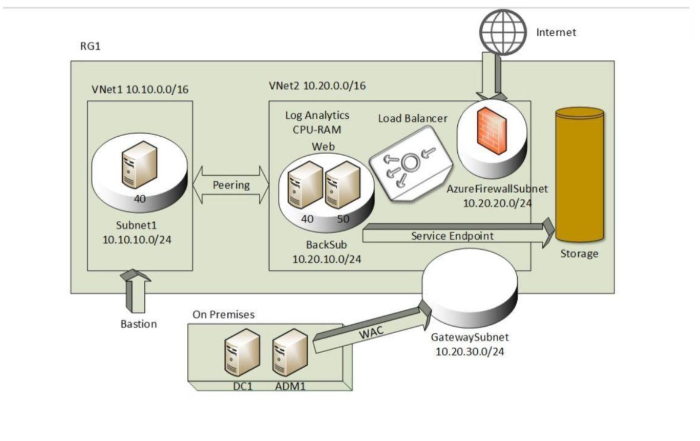

# Azure-Hybrid-Infra-Repo
Azure Cloud Infrastructure and Hybrid Management Project

| Management | WAC + VPN Gateway | Hybrid orchestration | Unified management experience |


---


## 🔍 Validation & Testing


| Test Scenario | Expected Outcome | Result |
|----------------|------------------|---------|
| Load Balancer Health Probe | Balanced HTTP responses | ✅ Success |
| Firewall DNAT | Internet → Load Balancer redirection | ✅ Success |
| FQDN Filtering | Outbound limited to Microsoft/Google | ✅ Success |
| Private DNS Lookup | Resolved internal FQDNs only | ✅ Success |
| File Share Access | Accessible via Service Endpoint | ✅ Success |
| WAC Remote Management | Secure VPN-based connectivity | ✅ Success |


All logs aggregated into **Azure Monitor** for correlation and alerting.


---


## 💡 Professional Reflection


This project exemplifies **architecture-driven thinking** — not just deploying resources, but orchestrating them to behave predictably, securely, and intelligently.
Each Azure component was selected for *purpose and impact*:


- **ASG + NSG:** Simplified access governance at enterprise scale.
- **Azure Firewall:** Policy-driven control and monitoring, centralizing trust.
- **Private DNS + Service Endpoint:** Data kept private by design.
- **WAC + VPN Gateway:** Operational excellence bridging cloud and on-prem.


> The real success of a Cloud Engineer isn’t in provisioning — it’s in designing systems that thrive under change.
This project proves the mindset of a **Cloud Architect who builds for resilience, manages for clarity, and secures for tomorrow.**


---


## 📂 Repository Structure
```
docs/
Azure_Implementation_Plan.docx
architecture-diagram.drawio
screenshots/
scripts/
map-drive.ps1
connectivity-tests.ps1
README.md
```


---


## 🧰 Tech Stack
**Azure IaaS**, **NSG**, **ASG**, **Azure Firewall**, **Standard Load Balancer**, **Private DNS**, **Azure Files**, **Service Endpoints**, **Defender for Cloud**, **VPN Gateway**, **Windows Admin Center (WAC)**, **Entra ID**


---


## 👨‍💻 Author
**Khaled Gamal Osman**
Azure & Systems Administrator | Cloud Infrastructure Engineer
[LinkedIn](https://www.linkedin.com/in/khaled-gamal-osman) | [Wuzzuf](https://wuzzuf.net/me/Khaled-Gamal-c7eafed4c6)


---


> *"Cloud isn’t about servers or VMs — it’s about engineering trust, visibility, and evolution into every packet."*
